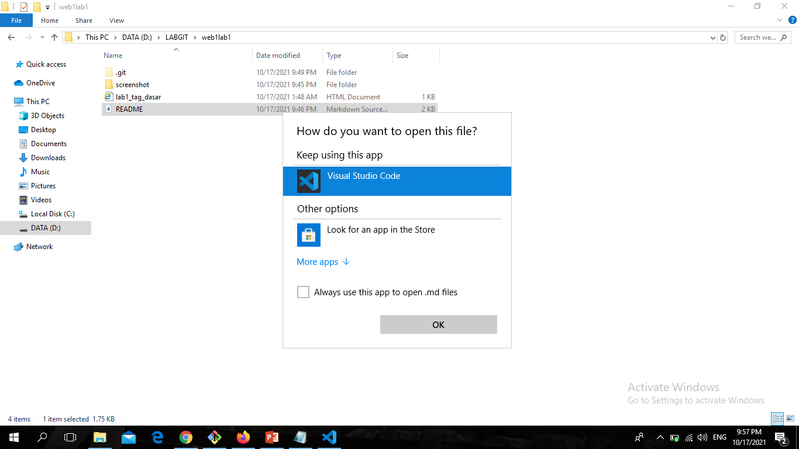

# LatihanVCS
## Tutorial Penggunaan Git

### Menginstall Git
1. Buka Github 

2. Jika Belum mendaftar klik Regiter/Sign up 

3. Jika sudah mendaftar silahkan klik Masuk/Sign in 

4. Jika sudah Sign in ,Kemudian klik Create repository 

5. kemudian isi Repository name 

6. deskripsi bebas di isi atau tidak 

7. Ceklist Add a README file 

8. kemudian klik Create repository 

9. Klik Code kemudian kalian bisa pilih HTTPS,SSH,Github,atau CLI. Lalu copy link yang tersedia 

10. Jika kalian belum instal git-scm silahkan, instal terlebih dahulu (skip jika sudah ada) 

11. Git-scm klik Download for Windows 

12. Jika sudah terdownload silahkan instal seperti biasa, klik next 

13. Buat satu folder baru untuk directory kerja 

14. Kemudian klik kanan pilih "Git Bash Here" 

15. Kemudian copy link HTTPS Github 

16. git clone 'link Github' ,lalu tekan Enter 

17. Kemudian muncul file README.md di file kalian 

18. Klik kanan pada mouse, lalu pilih open with pilih "Visual Studio Code" 

19. Jika kalian belum instal "Visual Studio Code" kalian bisa download VCS 

20. Setelah terbuka Visual Code Studio, pastikan kalian koding di file README.md 

21. Edit file README.md, lalu jangan lupa di save (ctrl+s) 

22. Setelah itu buka Git Bash yang sebelumnya 

> git add README.md 

> git commit -m "Dekripsi" 

> git push -u origin main 

23. SELESAI 

-Berikut adalah contoh Screenshot dan Tag Dasar HTML 

-Berikut adalah contoh menambahkan global config

 Buka aplikasi Git, pada saat pertama kali menggunakan git harus di config terlebih dahulu, kemudian ketik git config --global user.name "nama_user" dan git config --global user.email "nama_user" 

### Sekian Terima Kasih